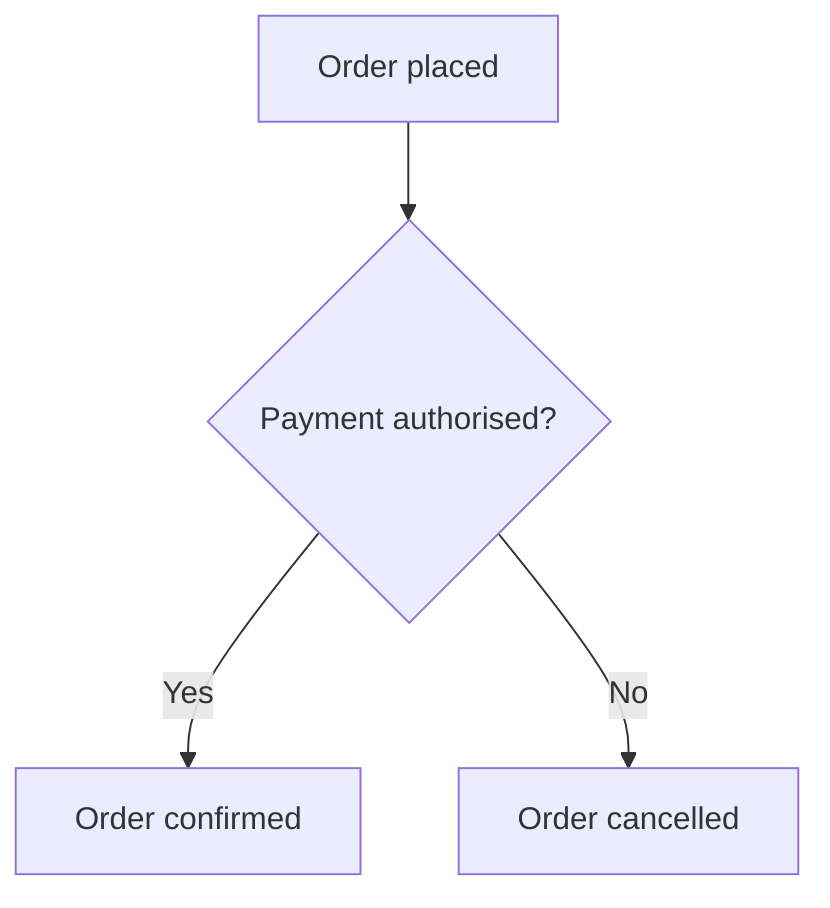

# Skill: mermaid-diagram

Produces Mermaid diagrams that render correctly in **GitHub**, **VS Code preview**.

---

## Fence syntax by target

| Target | Correct fence | Notes |
|---|---|---|
| GitHub / VS Code | ` ```mermaid ` | Standard markdown fence |
| Azure DevOps wiki | `:::mermaid` | Backtick fences do NOT render in ADO wiki |

When the target is **both** (e.g. a doc committed to GitHub but also published to ADO), use `:::mermaid` — it renders in both.

---

## ADO Wiki Constraints (must follow when targeting ADO)

| Rule | Detail |
|---|---|
| Use `graph TD` / `graph LR` | NOT `flowchart TD` / `flowchart LR` — `flowchart` type is unsupported in ADO |
| No `/` in node labels | `A[/signup]` → lexical error. Use `A[signup page]` |
| No `:` in node label text | `A[Fill form: details]` → lexical error. Use `A[Fill form - details]` |
| No `---->` (LongArrow) | Use `-->` only |
| No `subgraph` links | Links to/from subgraph nodes are unsupported |
| No Font Awesome | `fa:fa-icon` syntax is unsupported |
| No HTML tags inside labels | ADO strips HTML inside node text |

---

## Supported Diagram Types

- `graph` (flowchart) — most common for BC flows, state machines
- `sequenceDiagram` — service-to-service, command/event flows
- `classDiagram` — domain model, aggregate relationships
- `stateDiagram-v2` — order/payment/refund state machines
- `erDiagram` — DB schema overview
- `gantt` — roadmap / migration progress
- `gitGraph` — branch strategy docs

---

## Correct Fence Examples

**GitHub / VS Code:**
```

```

**ADO wiki (or dual-target):**
```
:::mermaid
graph TD
    A[Order placed] --> B{Payment authorised?}
    B -->|Yes| C[Order confirmed]
    B -->|No| D[Order cancelled]
:::
```

---

## Node Shape Reference

| Shape | Syntax | Use for |
|---|---|---|
| Rectangle | `A[label]` | Process step, outcome |
| Rounded | `A(label)` | Start / end state |
| Diamond | `A{label}` | Decision / condition |
| Stadium | `A([label])` | Terminal state |
| Parallelogram | `A[/label/]` | **Avoid when targeting ADO** — `/` triggers lexical error |

---

## Edge Label Syntax

```
A -->|label text| B
```

Keep label text short. Avoid special characters (`:`, `/`, `"`, `<`, `>`).

---

## Direction

- `graph TD` — top-down (sequential flows, order pipelines)
- `graph LR` — left-right (branching decision trees, BC dependency maps)

---

## Pre-output Checklist

Before generating a diagram, verify:

- [ ] Fence matches target (backtick for GitHub-only, `:::` for ADO / dual-target)
- [ ] Diagram type is `graph` not `flowchart` (when targeting ADO)
- [ ] No `/` in any node label text (when targeting ADO)
- [ ] No `:` in any node label text (when targeting ADO)
- [ ] No `---->` arrows
- [ ] Label text is short and plain
