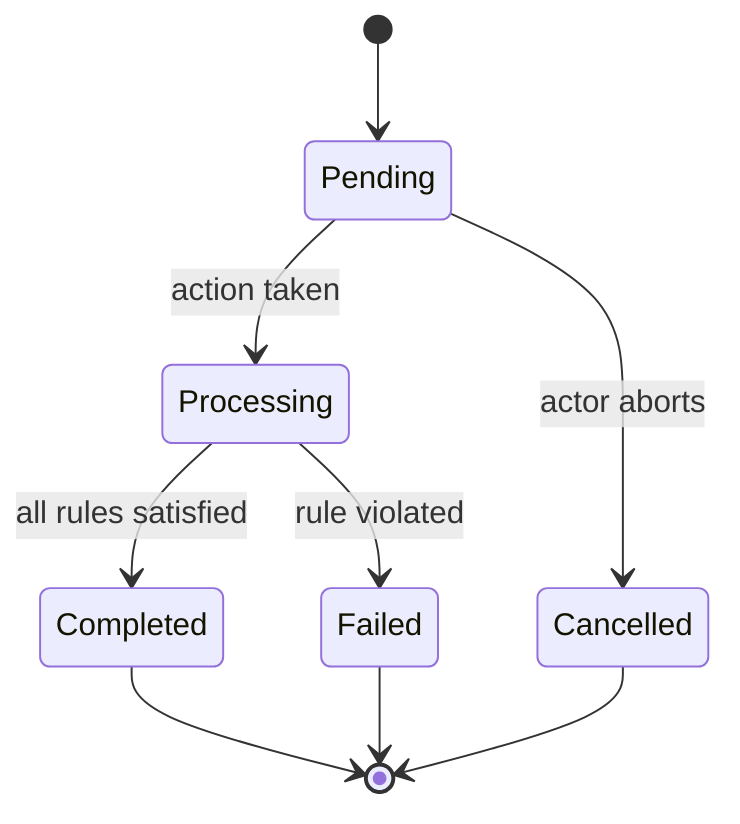

<!--
ECommerceApp — Business Flow Specification Template
@spec-writer uses this template. Fill all sections. Remove instructional comments before saving.

SINGLE FILE vs FOLDER:
- Single .md: simple flows, one entry point, fewer than 6 states, fewer than 10 rules.
- Folder (docs/specifications/<name>/): multiple entry points, many variants, or
  sub-documents referenced independently. Entry point is README.md.

MERMAID DIAGRAMS:
- Load .github/skills/mermaid-diagram/SKILL.md before generating any diagram.
- Prefer stateDiagram-v2 for state machines, graph TD for pipelines.
- For GitHub/VS Code: backtick fences work. For dual-target (GitHub + ADO): use :::mermaid.
- Rules: graph TD/LR only (not flowchart), no / or : in node labels.
-->

# Flow: <Flow Name>

> **Domain:** Catalog | Orders | Payments | Refunds | Coupons | Customers | Currencies
> **Status:** Draft / Approved / Deprecated
> **Last verified:** YYYY-MM-DD
> **Governing ADR:** `docs/adr/XXXX/XXXX-<title>.md` (use `query_docs()` to find — leave blank if none)
> **Primary code:** `ECommerceApp.<Layer>/<Domain>/` (implementation location)

---

## Purpose

One sentence describing what this flow achieves and why it matters to the business.

---

## Scope

### What this spec covers
- starting condition,
- which state transitions belong to this flow,
- terminal outcomes (success / failure / cancellation / timeout).

### What this spec does NOT cover
- implementation details (class names, method signatures, DB schema),
- URL routing and view navigation,
- persistence mechanism specifics,
- flows from other bounded contexts unless they are a direct dependency.

---

## Glossary

| Term | Meaning in this flow |
|---|---|
| Initiator | Entity that starts the flow (customer, admin, system) |
| State | Logical stage of the flow at a given moment |
| Terminal state | State from which no further transitions occur |
| _(add domain-specific terms)_ | |

---

## Actors

- **Customer** — registered user interacting through the Web or API.
- **Administrator** — back-office operator with management access.
- **System** — scheduled job, event handler, or external callback.
- _(add or remove actors relevant to this flow)_

---

## Entry conditions

All of the following must be true for the flow to start:

- condition A (e.g. user is authenticated),
- condition B (e.g. entity is in valid state),
- _(list all preconditions)_.

---

## Invariants and assumptions

- domain aggregate is the single source of truth for state transitions,
- no view or controller decides business outcomes — they observe state,
- state changes happen through named methods on the aggregate.

---

## States

| State | Description | Terminal? |
|---|---|---|
| Pending | Flow initiated, awaiting first action | No |
| Processing | Business logic executing | No |
| Completed | Flow ended successfully | Yes |
| Failed | Flow ended due to a business rule violation | Yes |
| Cancelled | Explicitly aborted by an actor | Yes |
| _(add domain-specific states)_ | | |

---

## State diagram

---

## Events

List every meaningful business event that can occur:

- flow initiated,
- _(describe each business event — not method calls, not HTTP requests)_,
- flow completed / failed / cancelled.

---

## Transition rules

| From state | Event | Guard condition | To state | Notes |
|---|---|---|---|---|
| Pending | Flow initiated | Entry conditions met | Processing | |
| Processing | Rule check passed | _(condition)_ | Completed | |
| Processing | Rule violated | _(condition)_ | Failed | |
| Pending | Actor aborts | _(condition)_ | Cancelled | |
| _(add rows)_ | | | | |

---

## Views / messages (optional)

Include when the flow has distinct user-facing states in the Web UI:

| State | View shown to user |
|---|---|
| Pending | Loading / waiting view |
| Completed | Success confirmation |
| Failed | Error message with reason |
| Cancelled | Cancellation acknowledgment |
| _(add domain states)_ | |

---

## Business rules

| ID | Rule |
|---|---|
| BR-001 | _(e.g. An order must contain at least one item.)_ |
| BR-002 | _(e.g. Payment amount must equal the order total exactly.)_ |
| _(add more)_ | |

---

## Edge cases

Describe known boundary scenarios (from known-issues.md, failing tests, or production bugs):

- actor retries while a flow instance is already active for the same entity,
- external dependency (e.g. payment gateway, NBP currency API) fails mid-flow,
- _(list domain-specific edge cases)_.

---

## Example scenarios

### Happy path — <describe the successful outcome>
1. Entry conditions are met.
2. Initiator triggers the flow.
3. System validates rules (BR-001, BR-002).
4. Flow reaches `Completed`.
5. Initiator receives confirmation.

### Failure path — <describe the rule-violation scenario>
1. Entry conditions are met.
2. Initiator triggers the flow.
3. Rule BR-00X is violated.
4. Flow transitions to `Failed`.
5. Initiator receives a descriptive error.

<!--
FOLDER README EXTENSION — use only when creating docs/specifications/<name>/README.md

Add below the Example scenarios section:

## Files in this folder

| File | What it contains |
|---|---|
| `states.md` | Extended state descriptions with entry/exit conditions |
| `rules.md` | Detailed business rules with examples |
| _(add files)_ | |
-->
