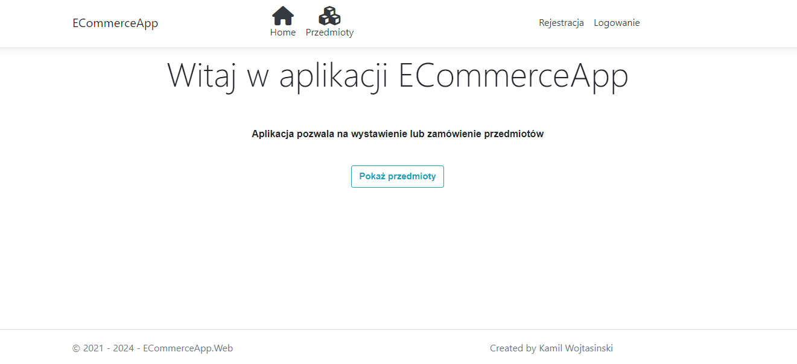

# ECommerceApp
> Simple Ecommerce application that allows place an offer on the website and order items.

## Technologies
* .NET Core 3.1
* ASP.NET, HTML5, CSS3, JS, MSSQL
* WebAPI
* Depedency Injection
* Entity Framework Core 
* LINQ
* Fluent Validation 
* AutoMapper 
* XUnit
* Moq 
* Fluent Assertions 
* Bootstrap

## General info
ECommerceApp is a web application written using MVC pattern. Application is made using clean and onion architecture. This application also includes a simple login system.

## Project
Application divided into repositories and services. The main purpose of this split was not to use entities directly. Services used ViewModels to modify, add, delete values to the database. Service had to map ViewModel into Entity. After that entity was sent to repositories, which modify data in the database. If the data was provided from database, service had to map Entity into ViewModel. 
Database scheme is shown on the figure below:

## Screens

## Status
Project is finished, but not closed. In the future, it is possible to expand the application in additional functionalities.
