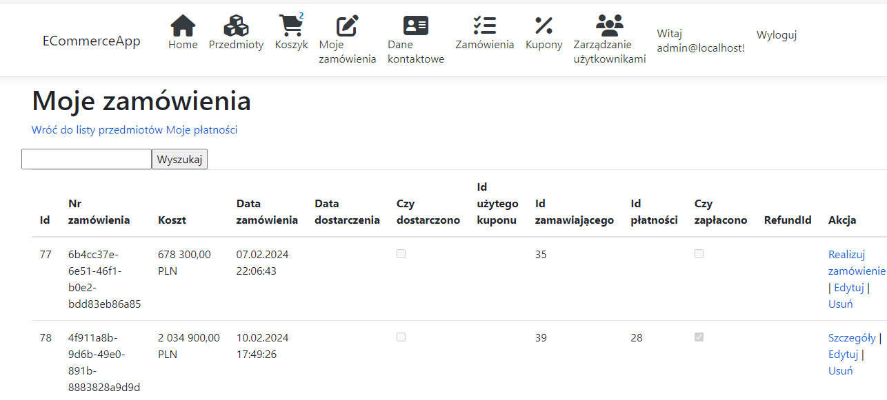
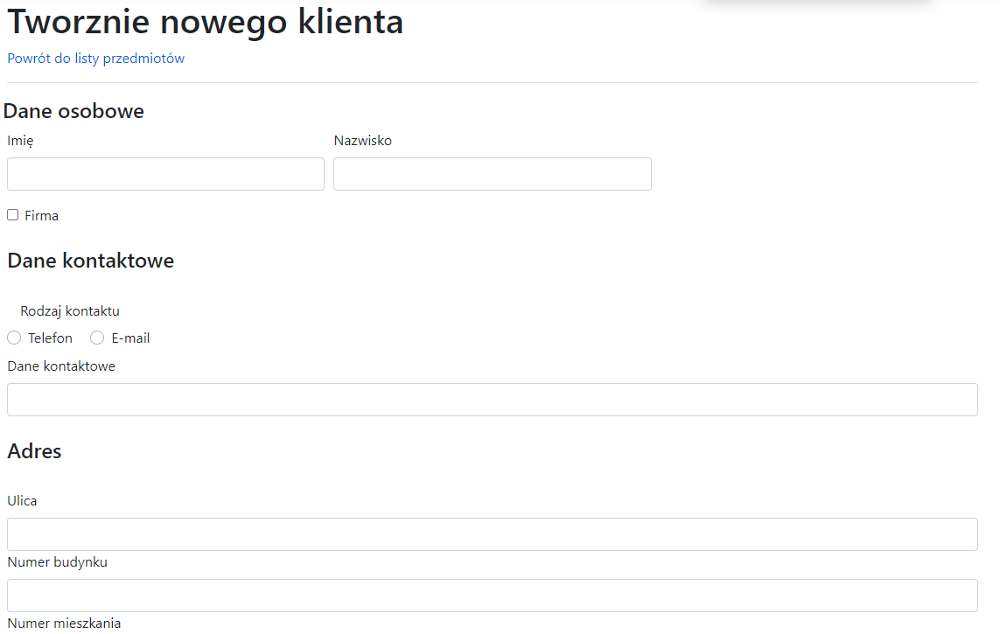
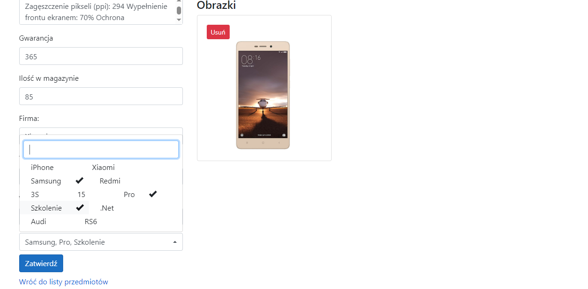
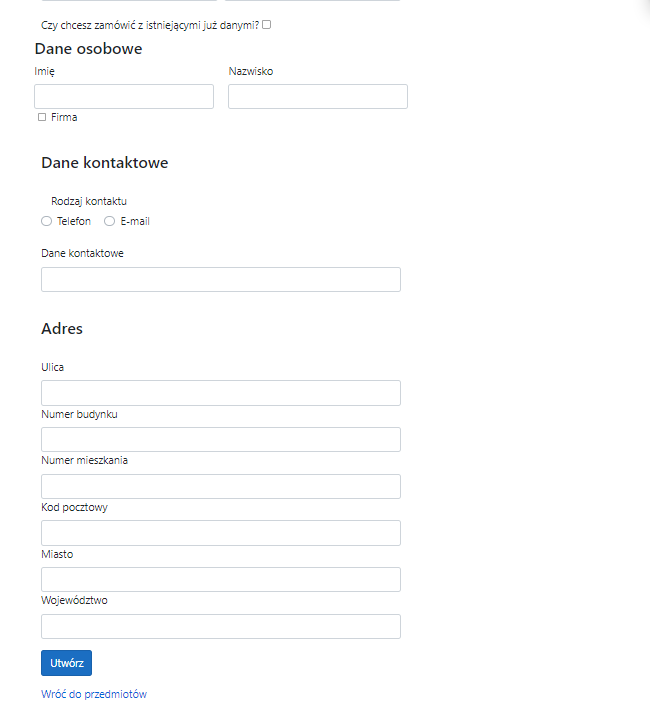
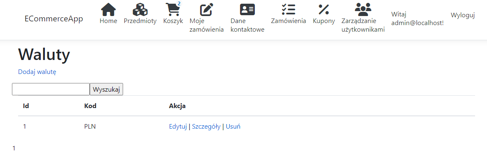

# ECommerceApp
> Simple Ecommerce application that allows place an offer on the website and order items.

# Admin User
> login:     admin@localhost
> password:  aDminN@W25!

# Problems with start
1. Update database using command Update-Database (apply all migration)
2. Add account google credentials, first navigate console to ECommerceApp.Web directory then
use this command or you can change it in appsettings.json section Authentication and Google
* dotnet user-secrets set "Authentication:Google:ClientId" "ClientIdFromGoogle"
* dotnet user-secrets set "Authentication:Google:ClientSecret" "ClientSecretFromGoogle"

Where can i get ClientId and ClientSecret?
* https://console.cloud.google.com/
Credentials and choose OAuth2, then create new data logging. In the section URI place https://localhost:44364/signin-google

# Docker run
Before run docker setup your database 
https://stackoverflow.com/questions/66210339/how-to-connect-to-a-local-sql-server-express-database-from-a-docker-composed-c-s 
Then add user docker to SQL using this script:
``` sql
CREATE LOGIN docker WITH PASSWORD=N'docker', 
                 DEFAULT_DATABASE=[master], CHECK_EXPIRATION=OFF, CHECK_POLICY=OFF

EXEC sp_addsrvrolemember 'docker', 'sysadmin'
CREATE USER docker FOR LOGIN docker WITH DEFAULT_SCHEMA=[dbo]
```
Make sure that option "SQL Server and Windows Authentication mode" is configured in MSSQL. 
Next in ECommerceApp root directory in powershell or cmd run this command:
> Docker compose up

## Technologies
* .NET 7
* ASP.NET, HTML5, CSS3, JS, MSSQL
* WebAPI
* Depedency Injection
* Entity Framework Core 
* LINQ
* Fluent Validation 
* AutoMapper 
* XUnit
* Moq 
* Fluent Assertions 
* jQuery
* Bootstrap
* RequireJS

## General info
ECommerceApp is a web application written using MVC pattern. Application is made using clean and onion architecture. This application also includes a simple login system.

## Project
Application divided into repositories and services. 
Database scheme is shown on the figure below:


## Screens
Screen 1


Screen 2


Screen 3


Screen 4


Screen 5


Screen 6


Screen 7


Screen 8


Screen 9


Screen 10


Screen 11


Screen 12


Screen 13


Screen 14


Screen 15


Screen 16


Screen 17


Screen 18


Screen 19


Screen 20


Screen 21


Screen 22


Screen 23


Screen 24


Screen 25


Screen 26


Screen 27


Screen 28


Screen 29


Screen 30


Screen 31


Screen 32


Screen 33


Screen 34


Screen 35


Screen 36


## Status
Project is finished, but not closed. In the future, it is possible to expand the application in additional functionalities.
