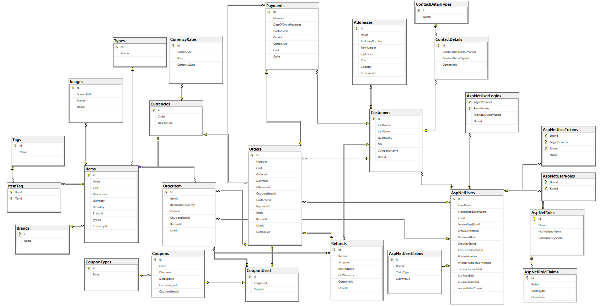
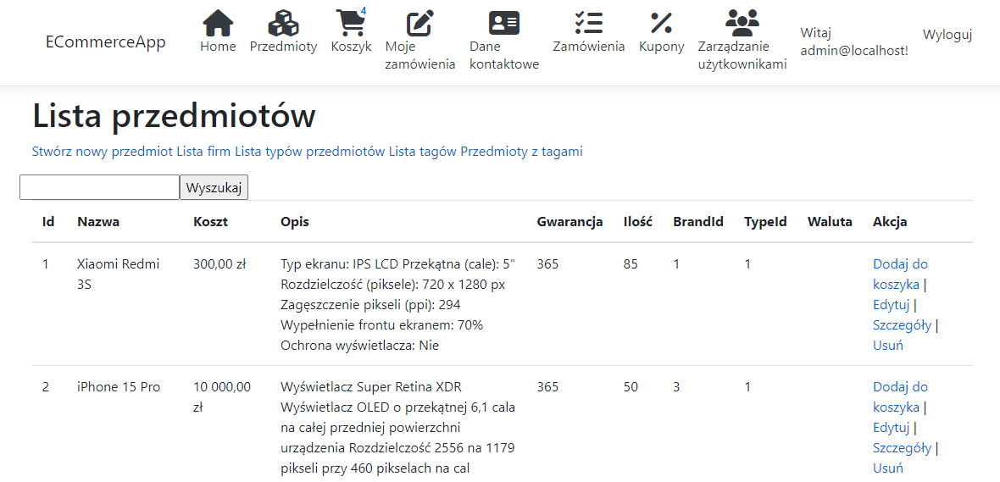
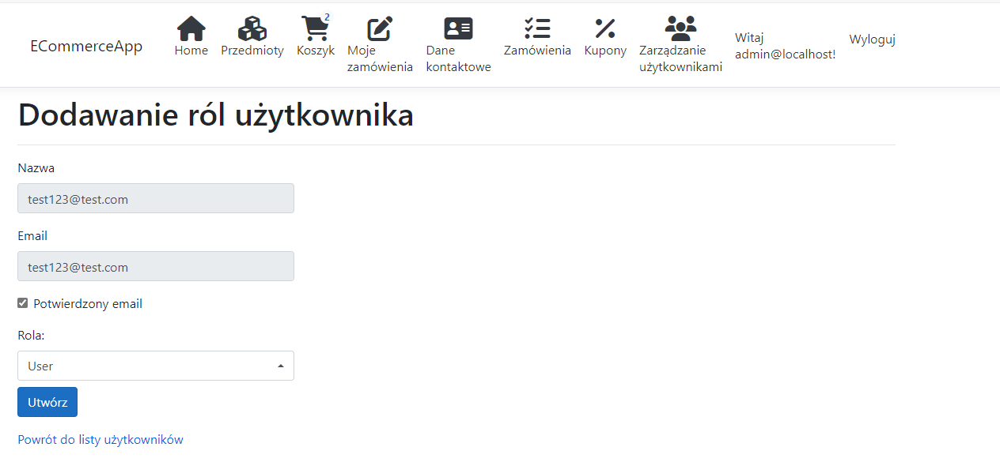
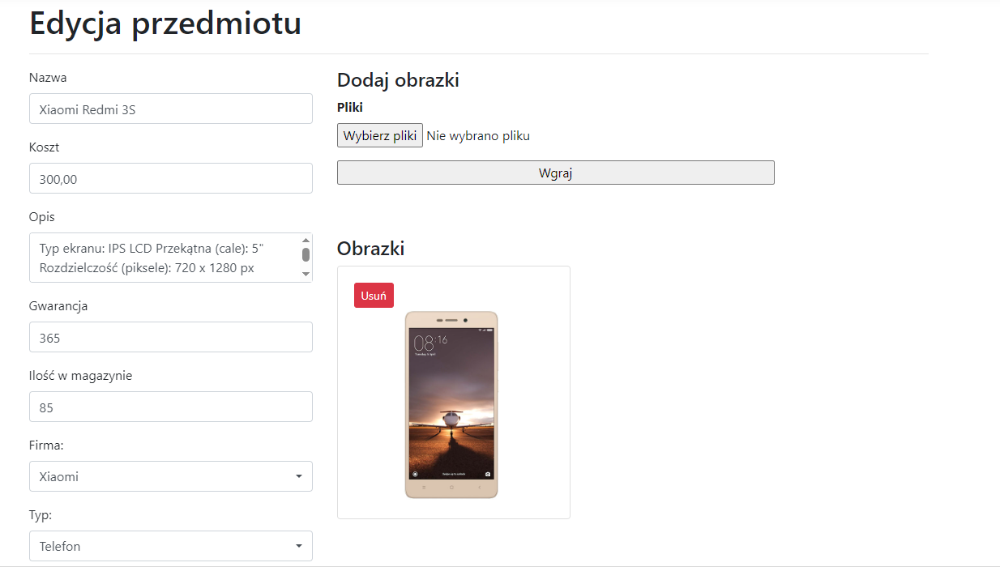
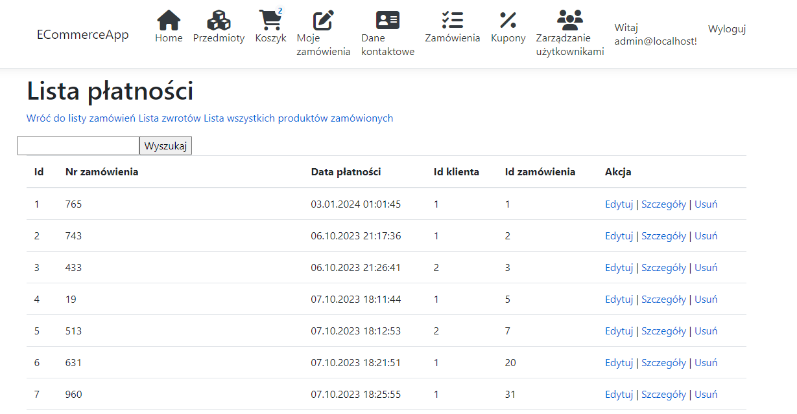

# ECommerceApp
> Simple Ecommerce application that allows place an offer on the website and order items.

# Admin User
> login:     admin@localhost
> password:  aDminN@W25!

# Problems with start
1. Update database using command Update-Database (apply all migration)
2. Add account google credentials
use this command 
> dotnet user-secrets set "Authentication:Google:ClientId" "ClientIdFromGoogle"
> dotnet user-secrets set "Authentication:Google:ClientSecret" "ClientSecretFromGoogle"
Where can i get ClientId and ClientSecret?
> https://console.cloud.google.com/
Credentials and choose OAuth2, then create new data logging. In the section URI place https://localhost:44364/signin-google

## Technologies
* .NET Core 3.1
* ASP.NET, HTML5, CSS3, JS, MSSQL
* WebAPI
* Depedency Injection
* Entity Framework Core 
* LINQ
* Fluent Validation 
* AutoMapper 
* XUnit
* Moq 
* Fluent Assertions 
* Bootstrap

## General info
ECommerceApp is a web application written using MVC pattern. Application is made using clean and onion architecture. This application also includes a simple login system.

## Project
Application divided into repositories and services. The main purpose of this split was not to use entities directly. Services used ViewModels to modify, add, delete values to the database. Service had to map ViewModel into Entity. After that entity was sent to repositories, which modify data in the database. If the data was provided from database, service had to map Entity into ViewModel. 
Database scheme is shown on the figure below:

## Screens
Screen 1

Screen 2

Screen 3

Screen 4

Screen 5

Screen 6

Screen 7

Screen 8

Screen 9

Screen 10

Screen 11

Screen 12

Screen 13

Screen 14

Screen 15

Screen 16

Screen 17

Screen 18

Screen 19

Screen 20

Screen 21

Screen 22

Screen 23

Screen 24

Screen 25

## Status
Project is finished, but not closed. In the future, it is possible to expand the application in additional functionalities.