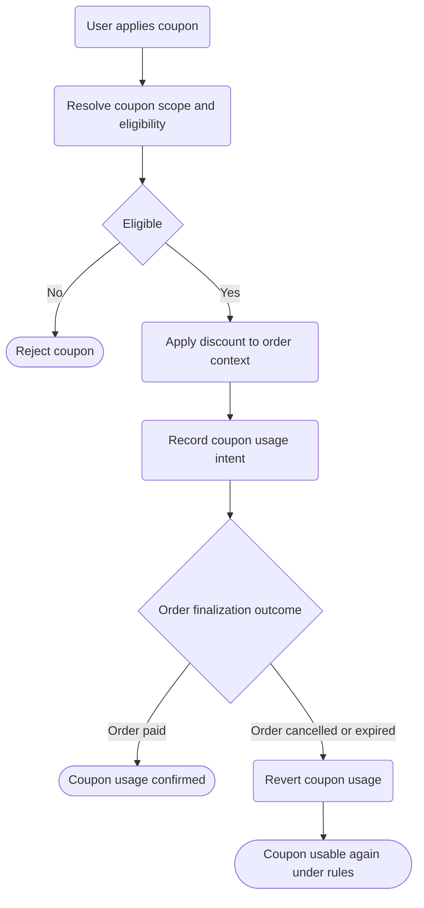

# Coupons Apply Revert Flow

High-level coupon application and rollback conditions.
Detailed business rules will be maintained in docs/specifications.

References:
- ../../../docs/specifications/coupons-apply-revert.md
- docs/adr/0016/0016-sales-coupons-bc-design.md
- docs/roadmap/README.md
