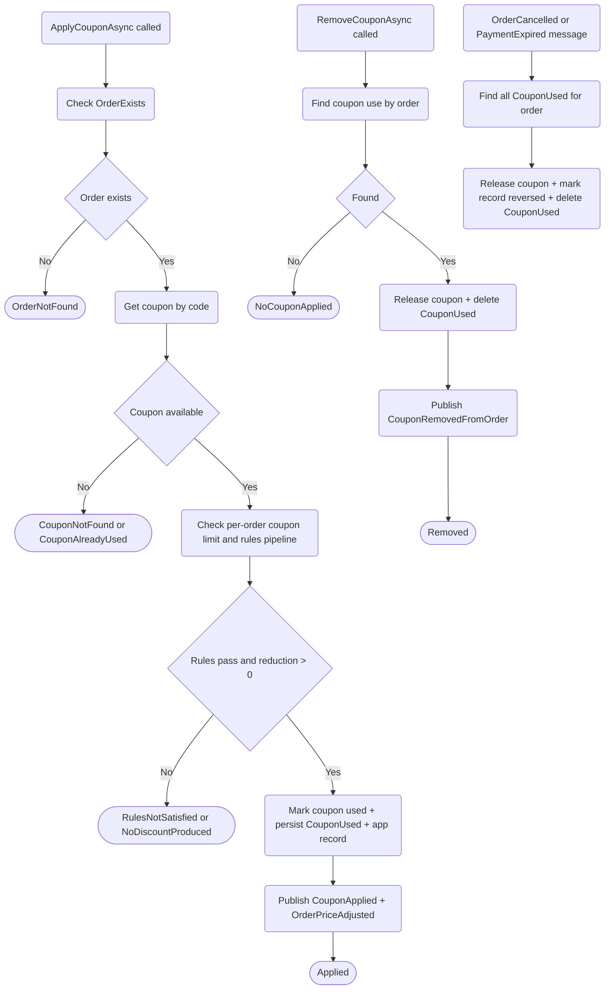

# Coupons Apply and Revert Flow

Current implementation flow from coupon service and compensation handlers.

References:

- ../../../docs/specifications/coupons-apply-revert.md
- ECommerceApp.Application/Sales/Coupons/Services/CouponService.cs
- ECommerceApp.Application/Sales/Coupons/Handlers/CouponsOrderCancelledHandler.cs
- ECommerceApp.Application/Sales/Coupons/Handlers/CouponsPaymentExpiredHandler.cs
