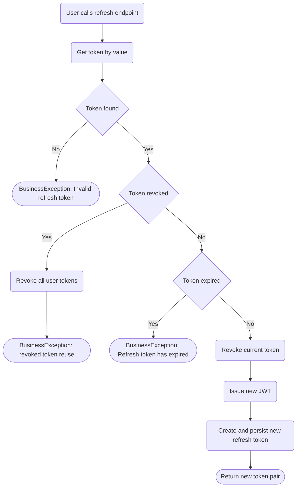

# IAM Refresh Token Flow

Current implementation flow (service + controller), without synthetic event naming.

References:

- ../../../docs/specifications/iam-refresh-token.md
- ECommerceApp.Application/Identity/IAM/Services/AuthenticationService.cs
- ECommerceApp.API/Controllers/IAM/AuthController.cs
