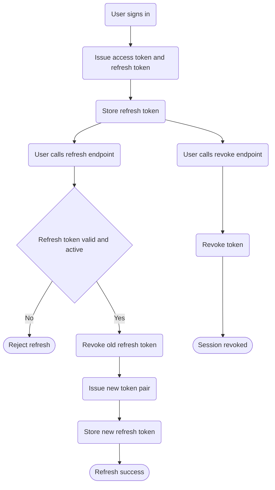

# IAM Refresh Token Flow

High-level token rotation and revoke behavior.
Detailed business rules will be maintained in docs/specifications.

References:
- ../../../docs/specifications/iam-refresh-token.md
- docs/roadmap/iam-refresh-token.md
- docs/adr/0019/0019-identity-iam-bc-design.md
