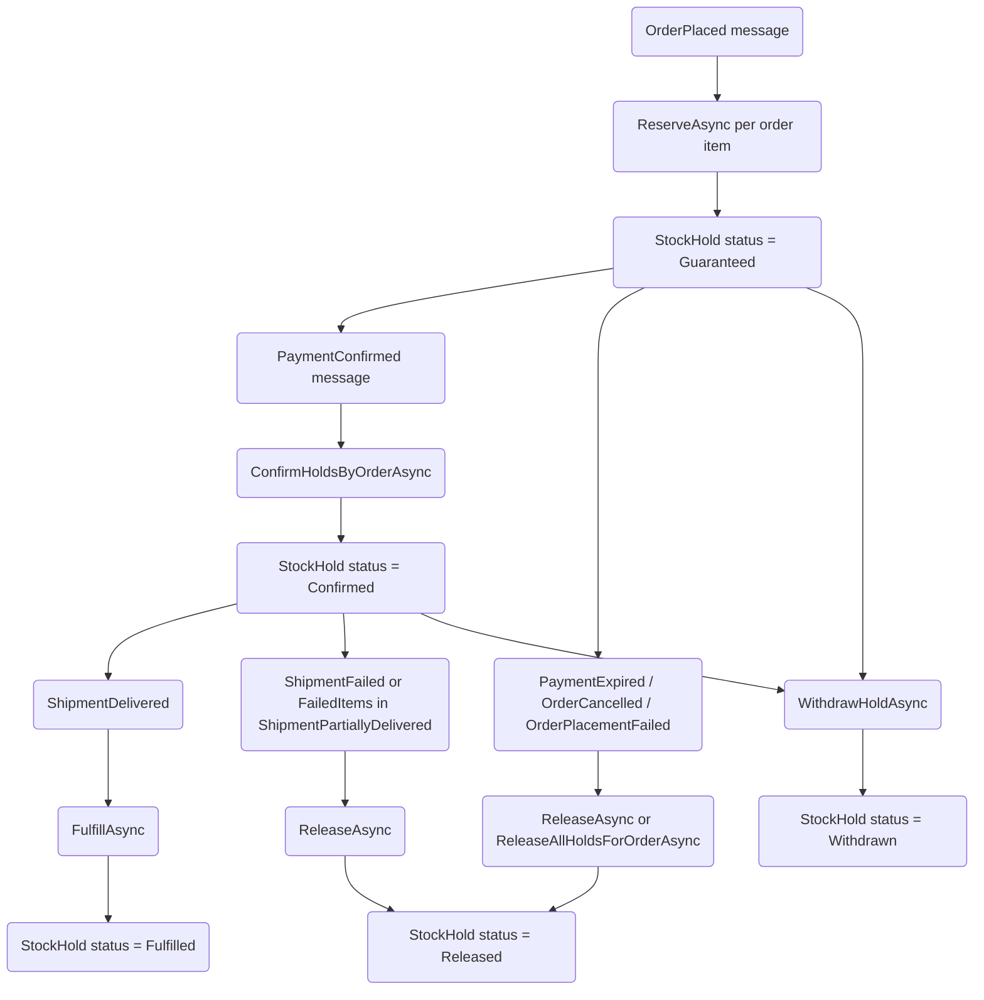

# Inventory Reservation and Release Flow

Current implementation flow for hard reservation lifecycle in Inventory.

References:

- ../../../docs/specifications/inventory-reservation-release.md
- ECommerceApp.Application/Inventory/Availability/Services/StockService.cs
- ECommerceApp.Application/Inventory/Availability/Handlers/*.cs
- ECommerceApp.Domain/Inventory/Availability/StockHoldStatus.cs
