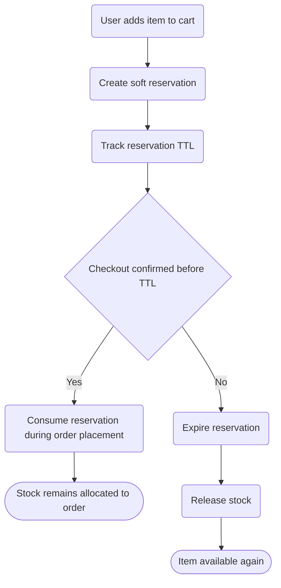

# Inventory Reservation Release Flow

High-level reservation lifecycle around checkout and timeout.
Detailed business rules will be maintained in docs/specifications.

References:
- ../../../docs/specifications/inventory-reservation-release.md
- docs/roadmap/presale-slice2.md
- docs/adr/0012/0012-presale-checkout-bc-design.md
- docs/adr/0011/0011-inventory-availability-bc-design.md
