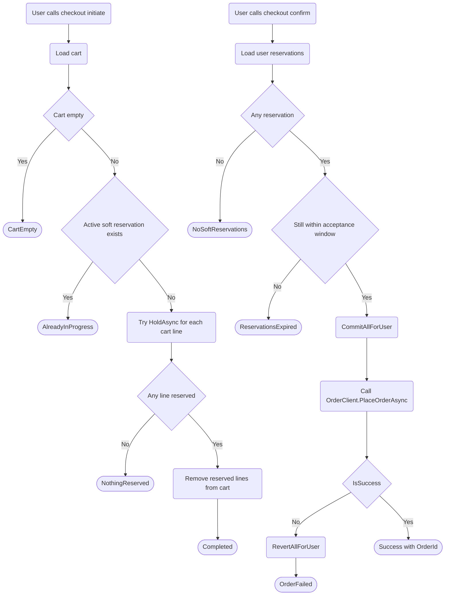

# Orders Checkout Flow

Current implementation flow from initiate/confirm to order placement integration.

References:

- ../../../docs/specifications/orders-checkout.md
- ECommerceApp.Application/Presale/Checkout/Services/CheckoutService.cs
- ECommerceApp.API/Controllers/Presale/CheckoutController.cs
- ECommerceApp.Application/Sales/Orders/Services/OrderService.cs
