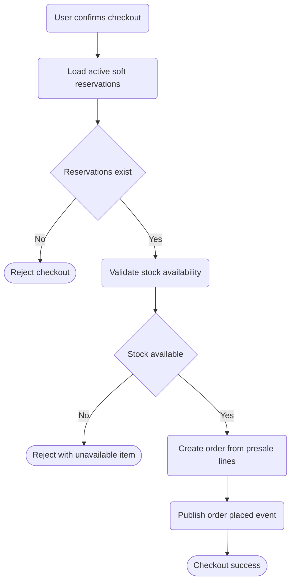

# Orders Checkout Flow

High-level flow from cart confirmation to order creation.
Detailed business rules will be maintained in docs/specifications.

References:
- ../../../docs/specifications/orders-checkout.md
- docs/roadmap/presale-slice2.md
- docs/adr/0012/0012-presale-checkout-bc-design.md
- docs/adr/0014/0014-sales-orders-bc-design.md
