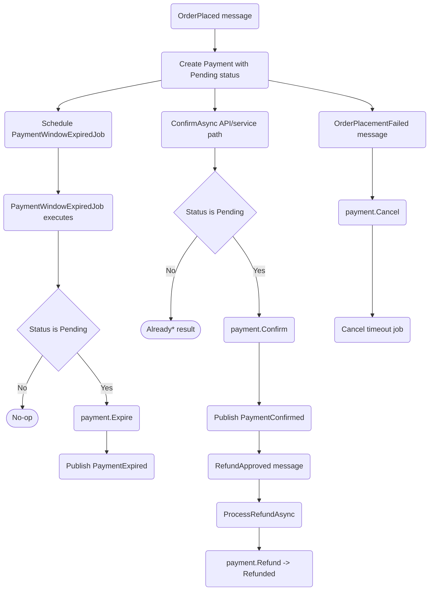

# Payments Lifecycle Flow

Current implementation flow based on payment handlers, service, and domain status rules.

References:

- ../../../docs/specifications/payments-lifecycle.md
- ECommerceApp.Application/Sales/Payments/Handlers/*.cs
- ECommerceApp.Application/Sales/Payments/Services/PaymentService.cs
- ECommerceApp.Domain/Sales/Payments/Payment.cs
