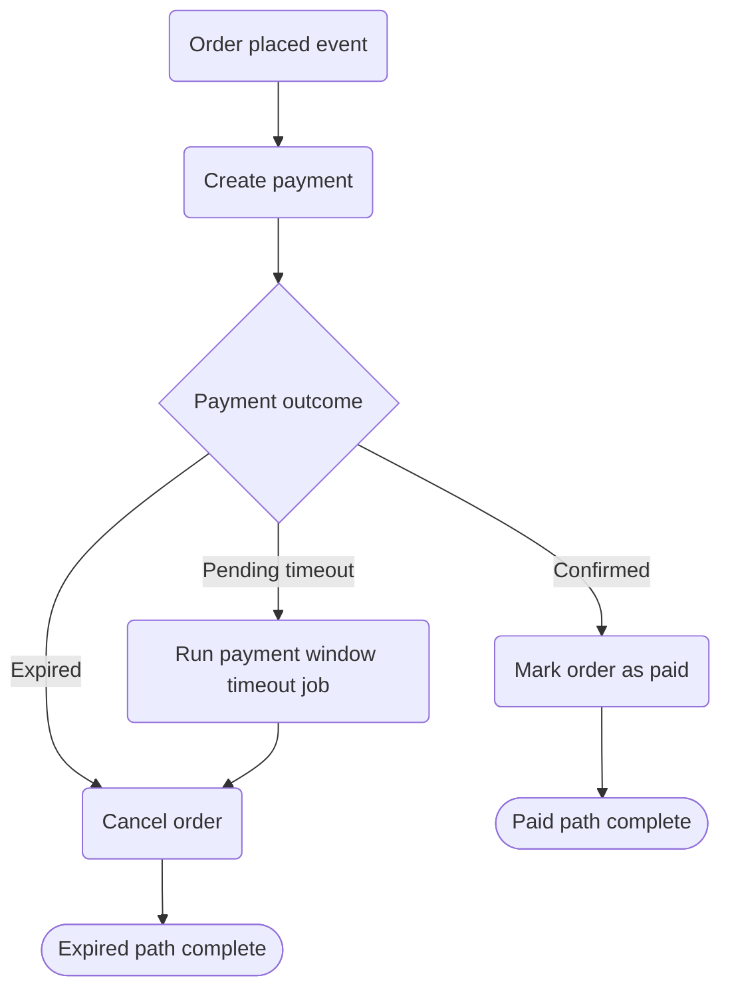

# Payments Lifecycle Flow

High-level payment state transitions and downstream impact.
Detailed business rules will be maintained in docs/specifications.

References:
- ../../../docs/specifications/payments-lifecycle.md
- docs/roadmap/payments-atomic-switch.md
- docs/adr/0015/0015-sales-payments-bc-design.md
- docs/adr/0014/0014-sales-orders-bc-design.md
